# Procesverslag
Markdown is een simpele manier om HTML te schrijven.  
Markdown cheat cheet: [Hulp bij het schrijven van Markdown](https://github.com/adam-p/markdown-here/wiki/Markdown-Cheatsheet).

Nb. De standaardstructuur en de spartaanse opmaak van de README.md zijn helemaal prima. Het gaat om de inhoud van je procesverslag. Besteedt de tijd voor pracht en praal aan je website.

Nb. Door *open* toe te voegen aan een *details* element kun je deze standaard open zetten. Fijn om dat steeds voor de relevante stuk(ken) te doen.

## Jij

  
uitwerken voor kick-off werkgroep

  ### Auteur:
  Rohit Gelaudie

  #### Je startniveau:
  Rood

  #### Je focus:
  Responsive
 

## Je website

  
uitwerken voor kick-off werkgroep

  ### Je opdracht:
  link naar de website die je gaat namaken óf de naam/omschrijving van je eigen ontwerp
  https://www.ticketswap.nl, dit is een website voor het kopen en verkopen van tickets.

  #### Screenshot(s) van de eerste pagina (small screen): 
  Ticketswap - Home
  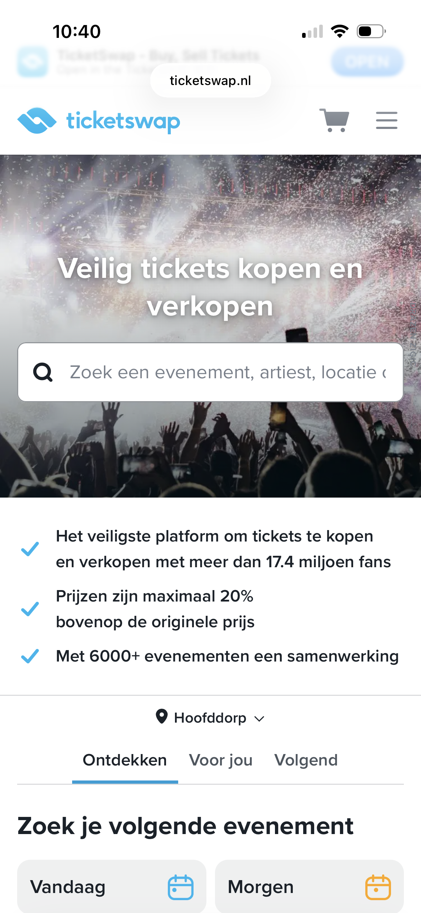
  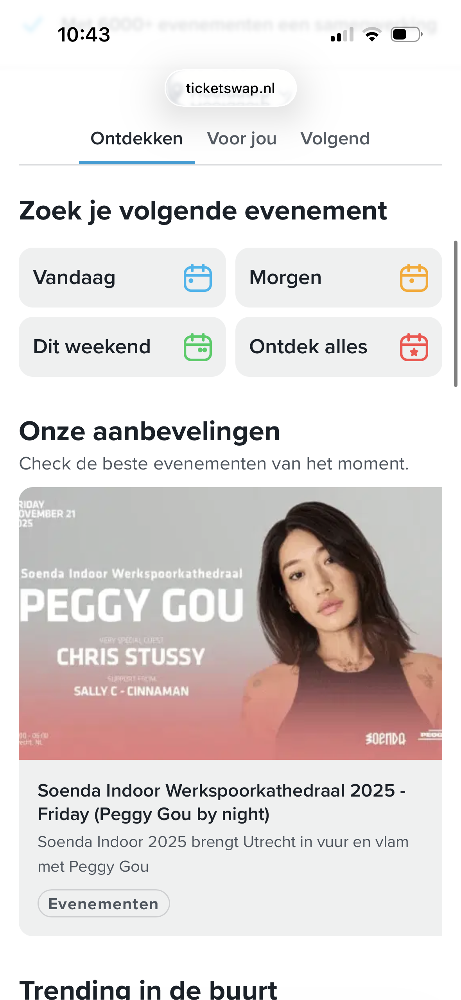

  #### Screenshot(s) van de tweede pagina (small screen):
  Ticketswap - Jouw tickets
  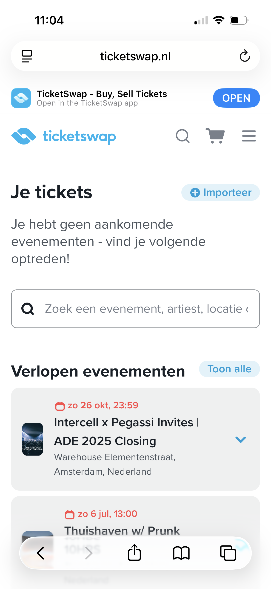
 

## Toegankelijkheidstest 1/2 (week 1)

  
uitwerken na test in 2e werkgroep

  ### Bevindingen
  Lijst met je bevindingen die in de test naar voren kwamen:

  Wat mij opviel aan Ticketswap is dat zij al hun links wel unieke namen geven maar dat het alleen nog niet heel duidelijk is waar die links voor zijn, dat komt voornamelijk door sommige Engelse termen die ze er bij voegen. De formulierregelaars zijn alleen niet uniek en hebben een onduidelijke naam. Hun globale code is wel heel erg goed en mankeert eigenlijk niets. Ik kan inzoomen, ze gebruiken een lang attribute en elke pagina heeft een unieke titel. Echter is de website niet heel toegankelijk. Met de tabtoets kom ik niet verder dan de zoekbalk.
  Op mobiel is de website wel weer heel goed, er is geen horizontale scoll, de webisite kan zowel horizontaal als verticaal bekeken worden en links en buttons zijn groot. Alle headings op de pagina kloppen ook en elke pagina heeft maar 1 h1. Lijsten zijn gemaakt met een li. De website mist alt teksten bij afbeeldingen waar tekst op staat. Verder zijn alle links een a en buttons buttons. Bij de website ontbreek wel nog de prefers-reduced-motion query.

  
  
  
  
  

  

## Breakdownschets (week 1)

  
uitwerken na afloop 3e werkgroep

  ### de hele pagina: 
  

   ### wellicht nog een dynamisch deel (bijv filter): 
  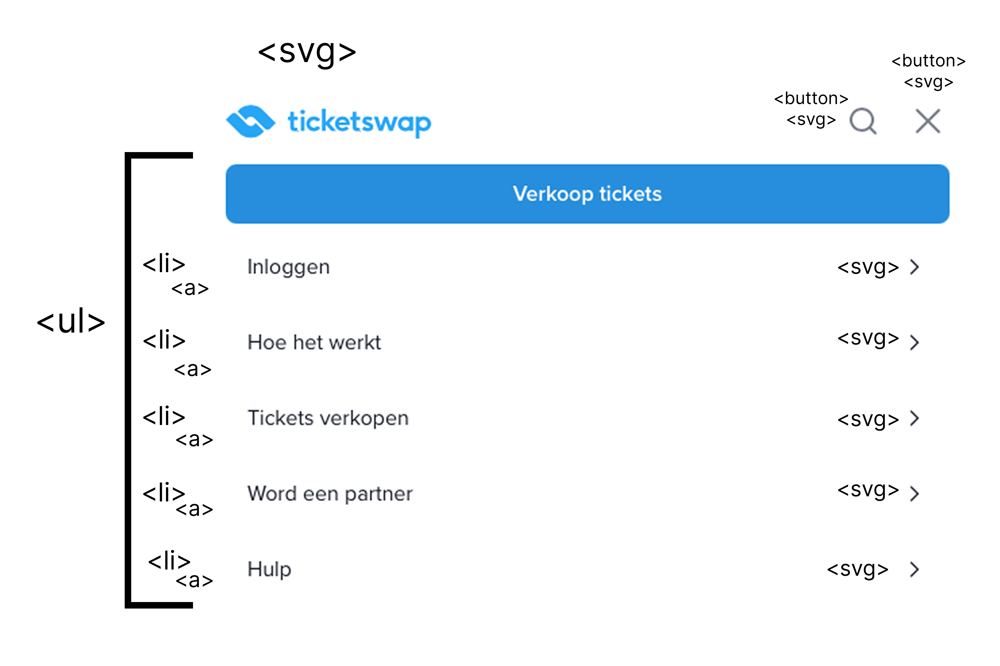
  

 
  

## Voortgang 1 (week 2)

  
uitwerken voor 1e voortgang

  ### Stand van zaken
  hier dit ging goed & dit was lastig (neem ook screenshots op van delen van je website en code)

  ### Agenda voor meeting
  samen met je groepje opstellen

  | Rohit   | Frank          | student 3    | student 4        |
  | ---            | ---                | ---          | ---              |
  | Ik wilde graag weten hoe ik die kleine evenement-cards maak en hoe ik dat doe met bijvoorbeeld een grid of met flex. Mijn code nu is bijzonder rommelig en werkt niet, hoe maak ik zo'n card?| Frank wilde graag weten hoe hij de detail-pagina kon opmaken, het ging er dan bij hem om dat hij wilde weten hoe je de categoriën net onder de afbeeldingen kreeg, zonder dat het te veel uit elkaar zou staan.             | en ik dit    | en dan ik dat    |
  | Ook wil ik graag weten hoe ik er voor zou kunnen zorgen dat alleen de header de volle breedte van de pagina neemt en de rest van de pagina 1em padding links en rechts heeft. | dit als er tijd is | nog een punt | dit wil ik zeker |
  | ...            | ...                | ...          | ...              |

  ### Verslag van meeting
  hier na afloop snel de uitkomsten van de meeting vastleggen

  De student-assistenten hebben mij aangeraden om een schets te maken van die card. Ze vertelde me dat het inderdaad met een grid kan en dat binnen die grid ook nog een flex zit voor de datum en het aantal tickets.

   

   Ik heb toen dat zelf geprobeerd te maken, en ik kwam al aardig op weg echter na het weekend lukte het me niet en heeft de docent mij geholpen om die evenementen cards af te maken, zo zien ze er nu uit:

   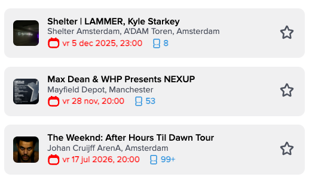

   Voor het fixen van de header en main van de pagina werd mij aangeraden / toestemming gegeven om om alle content in de main een div te zetten en die een padding: 0 1em; te geven. Dat heb ik gedaan, en het werkte.

   

## Voortgang 2 (week 3)

  
uitwerken voor 2e voortgang

  ### Stand van zaken
  hier dit ging goed & dit was lastig (neem ook screenshots op van delen van je website en code)

  In deze week heb ik de carousel gemaakt omdat die wel op de echte website staat, echter had ik deze nog niet gemaakt voor mijn eigen website. Ik had eigenlijk geen idee waar ik zou moeten beginnen, maar tijdens het voortgangsgesprek schreef ik gelijk mee. 

  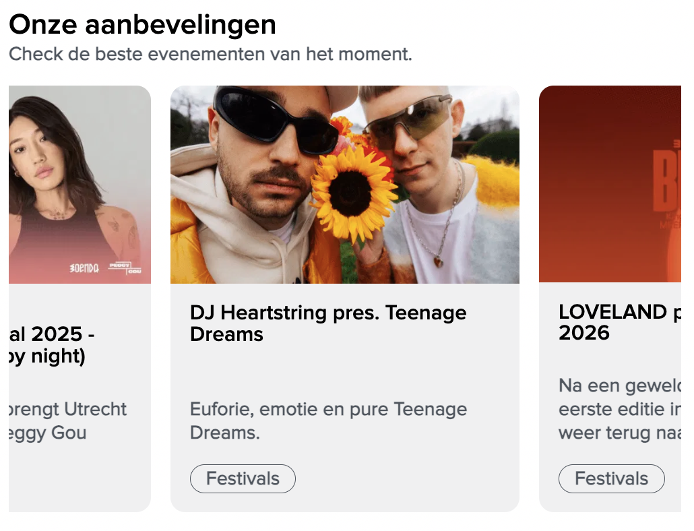
  
  Ook heb ik mijn hele home-pagina op een grid moeten zetten omdat ik van de docent de div die ik voor styling had gebruikt, niet mocht gebruiken. Ondanks wel die tip te krijgen van de student-assistenten.
  De div heb ik weggehaalt en die hele pagina op een grid gezet na uitleg van de docent. Dat was veel werk om over te zetten en alles recht te trekken. Het lukte me wel, maar mijn website is nu niet meer schaalbaar. Dit was de grid die al wel werkte:
  De titel met achtergrond heeft de gehele breedte van de pagina en de rest van alle contetn heeft zowel links als rechts 1em padding/witruimte.

  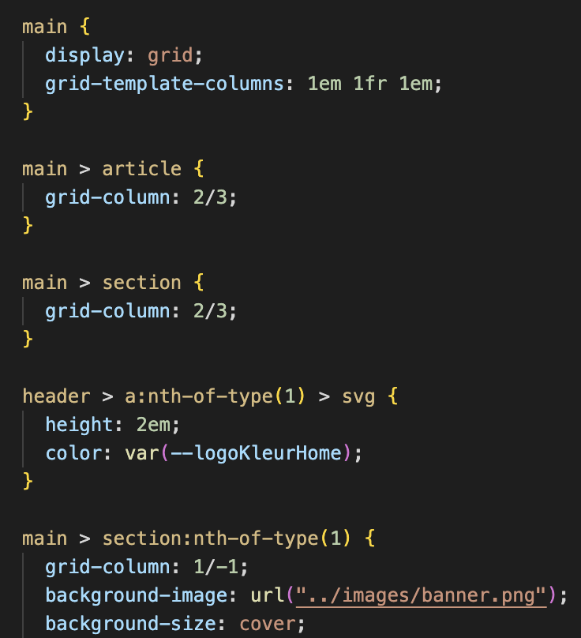
  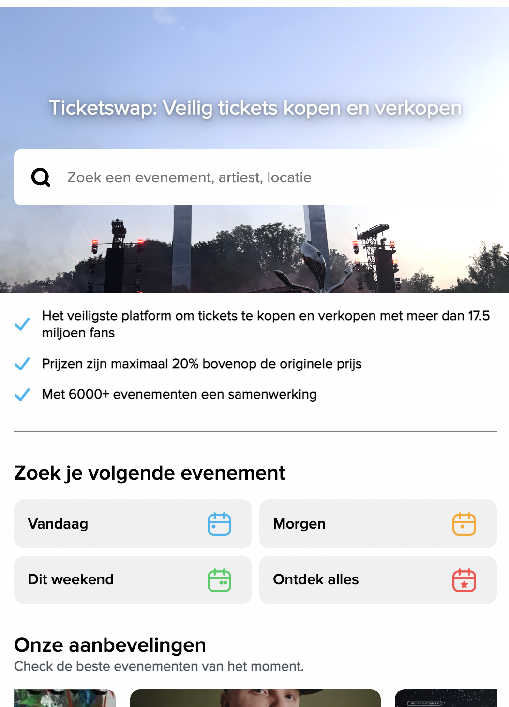
  
  Ik heb hier voor het eerst de dark-mode toegevoegd aan mijn website. Dat was echt wel even puzzelen van hoe dat ik dat goed op mijn pagina zou kunnen toepassen en hoe ik die code eigenlijk zou moeten schrijven. Wat ik lastig vond was het werken met de SVG's. Deze verpestte mijn code best wel erg, ook omdat ik somminge SVG's zelf al in Figma had nagemaakt omdat ik niet wist dat je de gebruikte SVG's van je gekozen website kon kopiëren en plakken in je eigen code.
  Na veel proberen, het gebruiken van de 'color-scheme: light dark;', het omzetten van alle img's naar SVG's en alle kleuren in de code omzetten is het mij uiteindelijk toch wel gelukt.

  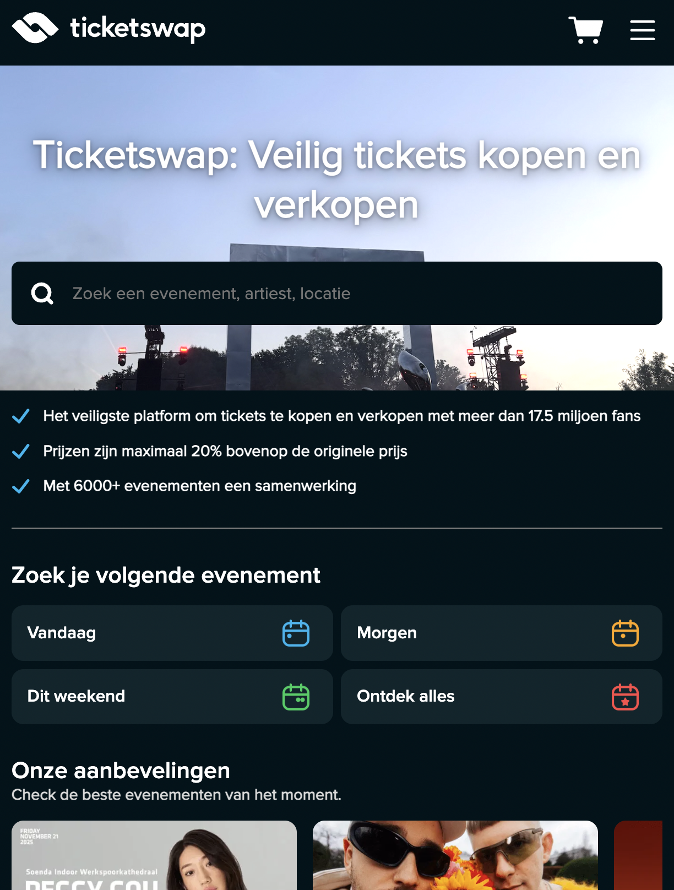
  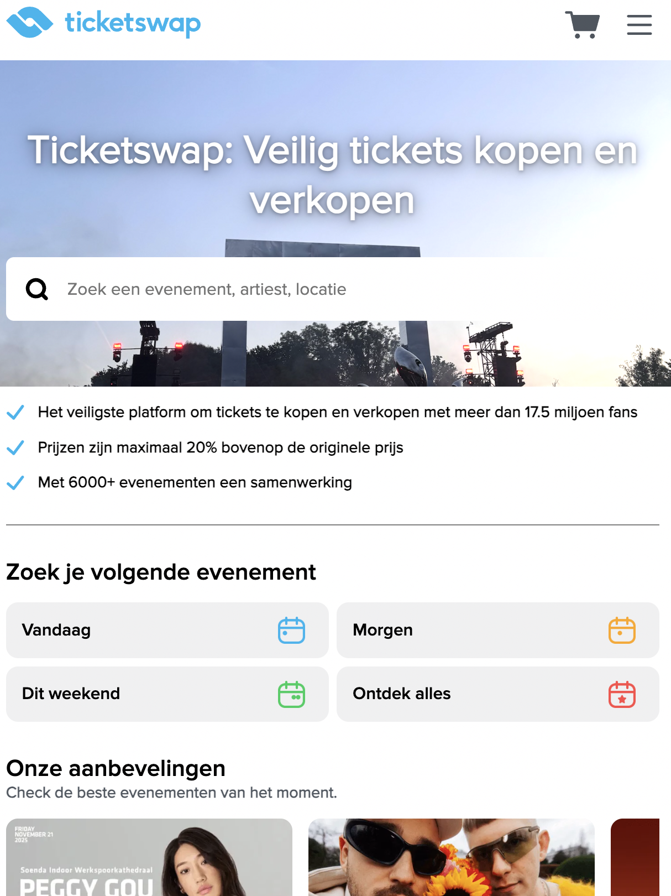
  

  ### Agenda voor meeting
  samen met je groepje opstellen

  | student 1      | student 2          | student 3    | student 4        |
  | ---            | ---                | ---          | ---              |
  | dit bespreken  | en dit             | en ik dit    | en dan ik dat    |
  | en dat ook nog | dit als er tijd is | nog een punt | dit wil ik zeker |
  | ...            | ...                | ...          | ...              |

  ### Verslag van meeting
  Ik had nog geen carousel gemaakt terwijl de echte website die ik had gekozen dat wel heeft. Ik was er nog niet aan toe gekomen en wist niet waar ik moest beginnen, totdat tijdens dit gesprek Linsy een soortgelijke vraag had van hoe maak je nou zo een carousel? De docent liet het haar zien, gelijk met code en ik typte gelijk mee. Door zijn uitleg begreep ik ook meteen hoe zo een carousel gemaakt werd en zo heb ik die meteen op mijn eigen website kunnen toepassen.

  Mijn grootste vraag voor dit gesprek was eigenlijk hoe kan ik mijn pagina op een grid zetten (werd aangeraden door de docent), omdat de div ide ik had gebruikt niet mag, ondanks ik die tip/toestemming wel kreeg van de stundent-assistenten. Die vraag was te groot om in die tijd op te lossen dus hij gaf me een aantal tips. In dat weekend heb ik vanalles geprobeerd, echter niks lukte me om het probleem op te lossen. De volgende maandag heeft de docent mij geholpen het probleem te verhelpen. Ik had code soms wel 4 keer herhaald waardoor de css zich ging overschrijven en het dus niet altijd werkte. Uiteindelijk lag het er aan dat ik die carousel geen width had gegeven dus dit was de boosdoener:

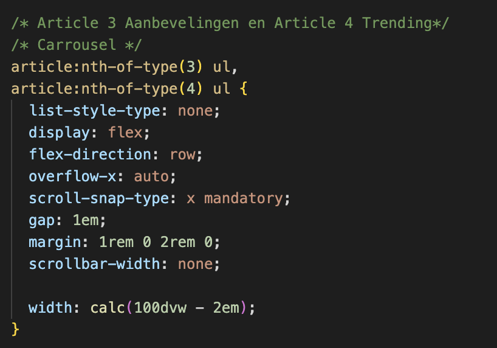
  

## Toegankelijkheidstest 2/2 (week 4)

  
uitwerken na test in 9e werkgroep

  ### Bevindingen
  Lijst met je bevindingen die in de test naar voren kwamen (geef ook aan wat er verbeterd is):

  In vergelijking met Ticketswap.nl heb ik al zeker een aantal goede verbeteringen doorgevoerd, ondanks dat er niet geweldig veel verbetering nodig had. Alle links zijn nu wel uniek, echter moet ik ze wel meer beschrijving geven. De enige error die Ticketswap had, heb ik niet. Nu kan je wel met tab door alle klibare elementen. Ook mijn website is goed te zien op horizonaal en verticaal beeld:

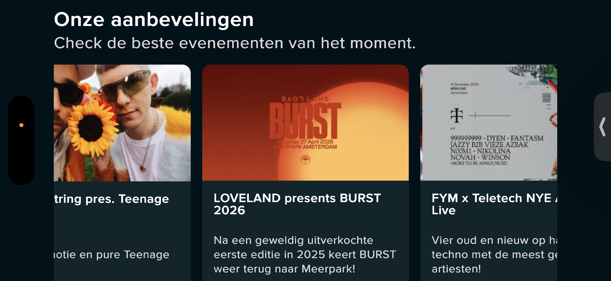
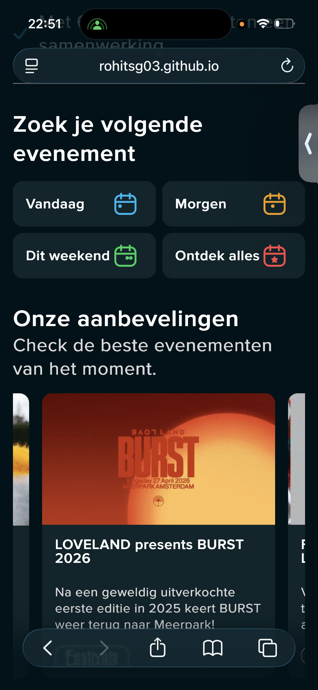

Ik heb alle headings heb ik van TicketSwap overgenomen dus dat is was al goed, ook elke list die ik heb is gemaakt met een li. De meeste img's en svg's hebben al een alt, echter moet ik de alt uitschrijven voor afbeeldingen waar teskt op staat. Nog niet alle links en buttons hebben een :focus, maar het is al veel meer dan TicketSwap zelf. Ook heb ik pijltjes al toegevoegd om aan te duiden wanneer een link een nieuwe pagina opent:

 
  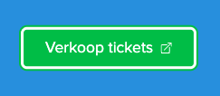

  Ik moet de reduce motion ook nog toevoegen aan mijn pagina.
  
  
  
  
  
  

## Voortgang 3 (week 4)

  
uitwerken voor 3e voortgang

  ### Stand van zaken
  hier dit ging goed & dit was lastig (neem ook screenshots op van delen van je website en code)

  In deze week heb ik veel dingen in mijn code opgeschoond. Ook heb ik :focus, :active en :hover aan klikbare elementen toegevoegd.
  
  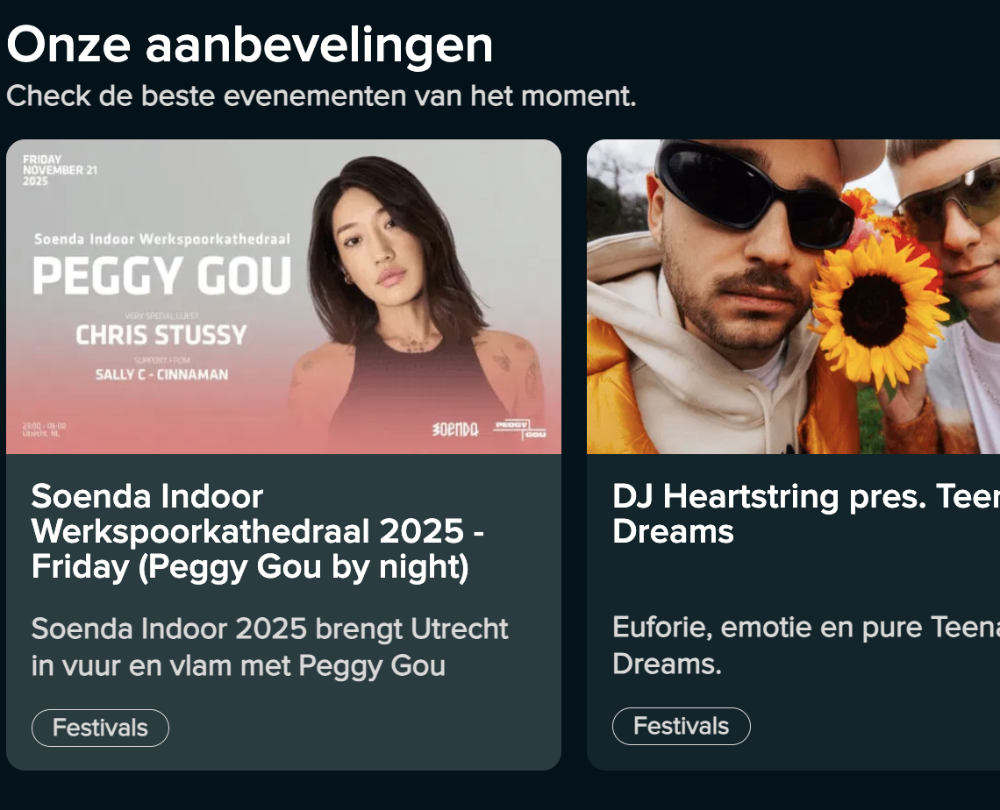
  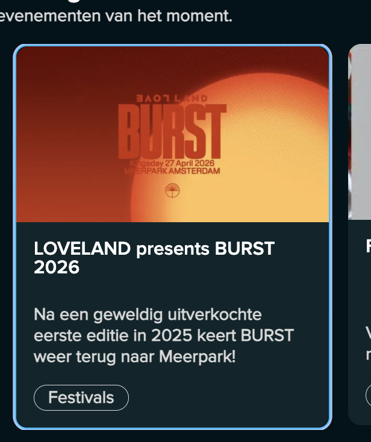
  
  
  Verder heb ik alle cards met content klikbaar gemaakt omdat dat op de echte website ook klikbare elementen zijn. Waarvan ik dacht dat iets een button was, was dat bijvoorbeeld niet, maar gewoon een p element. Dat was wel weer veel aanpassen van css code, ook omdat sommige cards dan weer niet goed werden uitgelijnd, te groot waren of dat de hoogtes verschilde. Dat vond ik wel moeilijk, het uitlijnen van de verschillende p's en koppen in die cards, dat alles gelijk staat en een gelijke hoogte heeft.
  
  In deze week heb ik ook eindelijk het hamburger menu gemaakt en opgemaakt. Dit vond ik best wel lastig maar na het maken van de opdracht en die code toepassen op mijn eigen website, is het wel gelukt. Ik heb de darkmode verder uitgebreid en aangepast voor een beter contrast, denk hierbij aan de felle rode kleur van de datum met het kalender icoontje aangepast voor darkmode zodat het minder scherp op je ogen is:
  
  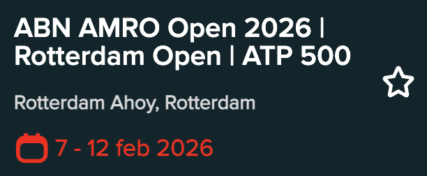
  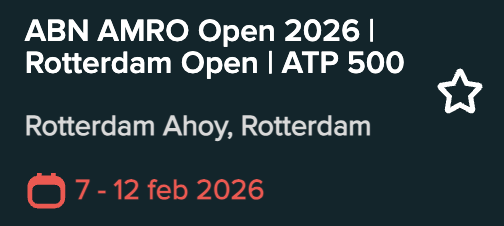

Toch heb ik ook in de laaste week, voor de deadline heb ik alle :focus elementen verbetert. Het was veel gepuzzel met de light-dark kleuren en welke kleuren goed contrast gaven en welke niet.  

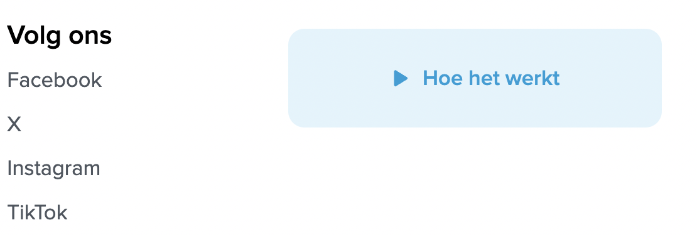
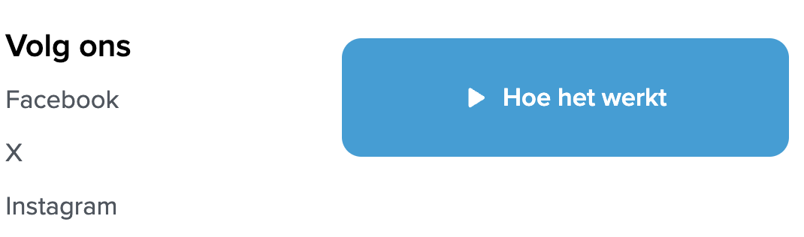

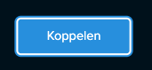
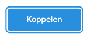

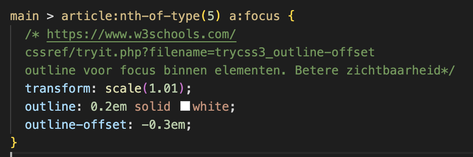

Ook bij de :hover het contrast van alle buttons verbetert, soms niet veel, bij andere heel veel:

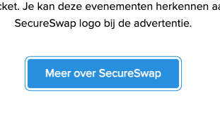
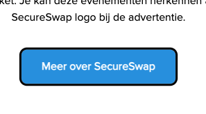

  
  

  
  

  ### Agenda voor meeting
  samen met je groepje opstellen

  | student 1      | student 2          | student 3    | student 4        |
  | ---            | ---                | ---          | ---              |
  | - Waarom de articles van Maak de club onveilig op groot scherm niet mooi in het midden staan uitgelijnd.  | en dit             | en ik dit    | en dan ik dat    |
  | - Hoe kan in het onderdeel van Spotify wegklikken dmv dat kruisje? | dit als er tijd is | nog een punt | dit wil ik zeker |
  | - Hoe maak ik een uitklapbaar menu voor in de footer?
  - De grid van de tweede section in de footer werkt niet, hoe los ik dit op? Inspecteren zegt iets van door display block van het bovenliggende element heeft grid area geen effect.| ...                | ...          | ...              |

  ### Verslag van meeting
  hier na afloop snel de uitkomsten van de meeting vastleggen

  De student-assistenten hebben mij met al mijn vragen kunnen helpen. Aan de vraag over de footer zijn we helaas niet toegekomen omdat een medestudent mij daar mee wilde helpen. Bij de eerste vraag was het probleem dat ik het grid waar die articles op stonden op groot scherm vergeter was een grid-template-columns te geven.
  De vraag over het wegklikken van de spotify pop-up vereiste Javascript. De student-assistenten hebben me stap voor stap geholpen met het schrijven van die code. Dat ging gelukkig ook erg goed en ik begrijp de code denk ik goed genoeg om redelijk uit te kunnen leggen hoe het werkt.

  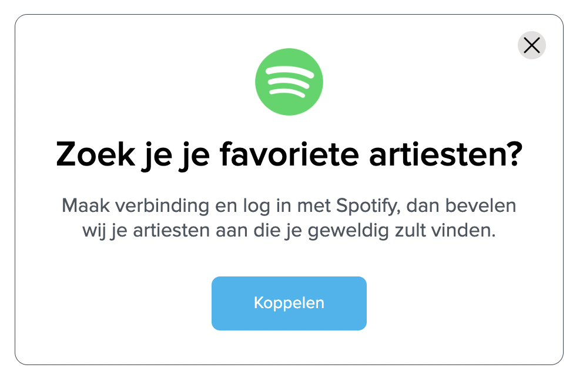
  
  Dat het grid niet werkte in de tweede section in de footer was omdat er een verschil zat in de img en svg en omdat in element erboven het niet op een grid stond waardoor dat ook niet goed werkte.

## Eindgesprek (week 5)

  
uitwerken voor eindgesprek

  ### Je uitkomst - karakteristiek screenshots:
  

  ### Dit ging goed/Heb ik geleerd: 
  Korte omschrijving met plaatjes

  Wat ik heb geleerd en wat ik inmiddels heel vaak gebuik zijn grids, css nesten en ook het gebruiken van grid-areas. Daarnaast heb ik ook veel meer geleerd over display flex en hoe je dingen goed kan uitlijnen. Het gebruiken van grid gaat nu echt heel goed, tevens als het nesten van css. Heel handig en overzichtelijk is dat ook.

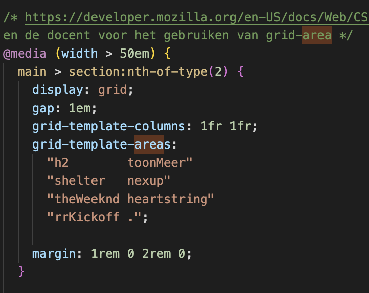
  
  Het maken van een darkmode was erg uitdagend maar na lang coderen en het omzetten van alle img's naat svg's is het me wel gelukt om een mooie darkmode te maken. Ik heb ook de echte website op contrast verbetert:

  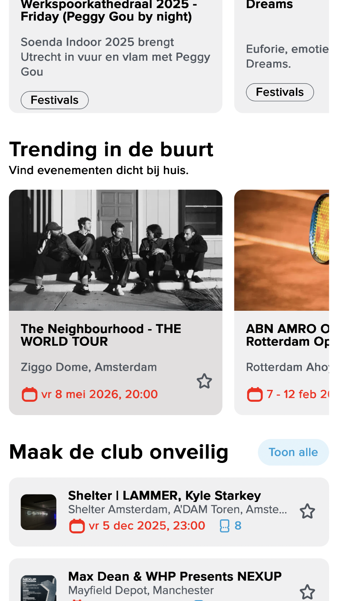
  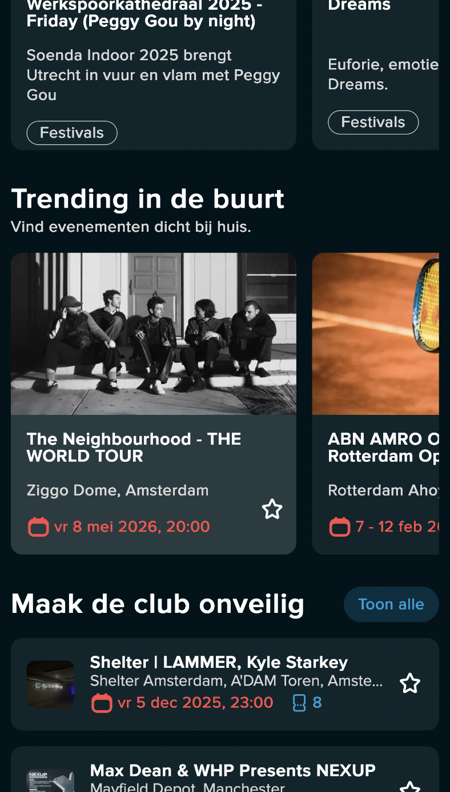

  ### Dit was lastig/Is niet gelukt:
  Korte omschrijving met plaatjes

  Wat ik wel graag nog had willen doen is een nav-bar hebben dat wanneer deze op groot scherm is het geen hamburger-menu meer heeft maar dat alle links uitgeschreven in de nav-bar zijn. Zoals dit:

  
  
  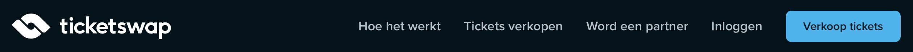

  Daarnaast is het me helaas niet op groot scherm op de homepagina gelukt om van een grid van 1em 1fr 1em naar bijvoorbeeld 10em 1fr 10em te gaan. Dus dat er op een groot scherm meer witruimte aan de zijkanten is:

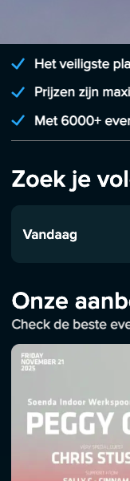
  

  

## Bronnenlijst

  
continu bijhouden terwijl je werkt

  Nb. Wees specifiek ('css-tricks' als bron is bijv. niet specifiek genoeg). 
  Nb. ChatGpT en andere AI horen er ook bij.
  Nb. Vermeld de bronnen ook in je code.

  Bron 1: https://developer.mozilla.org/en-US/docs/Web/CSS/Reference/Properties/grid-area en de docent voor het gebruiken van grid-area.

  Bron 2: https://css-tricks.com/almanac/rules/k/keyframes/ voor een herinnering hoe ik keryframes gebruikte.
  
  Bron 3: https://developer.mozilla.org/en-US/docs/Web/Accessibility/ARIA/Reference/Attributes/aria-label voor welke elementen een aria-label moeten hebben.

  Bron 4: https://css-tricks.com/almanac/rules/m/media/prefers-reduced-motion/ voor het toevoegen van reduced-motion aan mijn website.

  Bron 5: https://developer.mozilla.org/en-US/docs/Web/CSS/Reference/Properties/grid-row herinnering voor de grid-span property.

  Bron 6: https://developer.mozilla.org/en-US/docs/Web/CSS/Reference/Properties/border-top-left-radius , wilde weten hoe ik de border voor alleen de bovenkant van een element kon veranderen.

  Bron 7: https://developer.mozilla.org/en-US/docs/Web/HTML/Reference/Elements/details en https://www.w3schools.com/tags/tag_summary.asp hoe ik in de footer een uitklapbaar menu/nav kon maken.

  Bron 8: https://www.w3schools.com/js/js_functions.asp hoe ik JS functies moest schrijven.

  Bron 9: https://css-tricks.com/css-counters-custom-list-number-styling/ en de docent voor de vier stappen van het verkopen van een ticket.

  Bron 10: https://dev.to/itstrueintheory/are-negative-css-margins-bad-practice-lh7 of ik negatieve margina mocht gebruiken.

  Bron 11: https://www.w3schools.com/cssref/tryit.php?filename=trycss3_outline-offset voor het maken van een constistente focus die ook past bij de stijl die bij de website past en altijd te zien is.

  Bron 12: https://validator.w3.org/nu/ voor het valideren van mijn code.

  Bron 13: https://www.w3schools.com/css/css3_flexbox_container.asp opfrisser voor css flexbox.

  Bron 14: https://www.w3schools.com/graphics/svg_fill.asp uitleg waarom ik mijn svg's niet van kleur en grootte kon veranderen.

Bron 15: https://www.w3schools.com/html/html_favicon.asp voor het toevoegen van een favicon aan mijn website.

Bron 16: https://developer.mozilla.org/en-US/docs/Web/HTML/Reference/Elements/label voor het toevoegen van een label aan de input.
